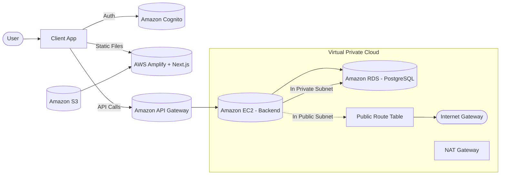
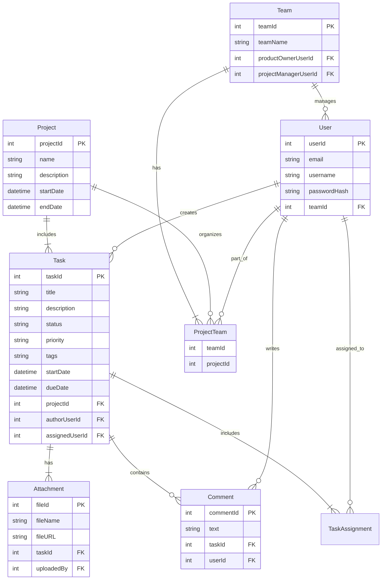
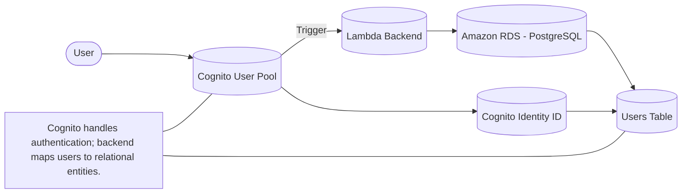
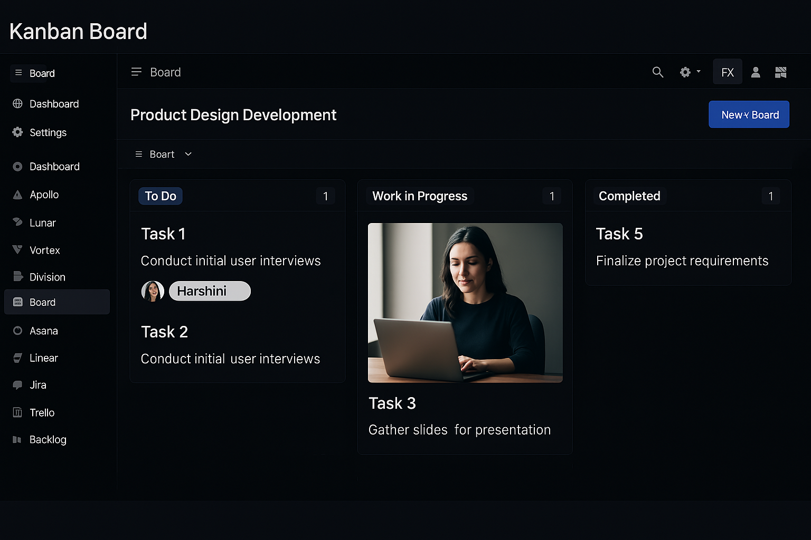
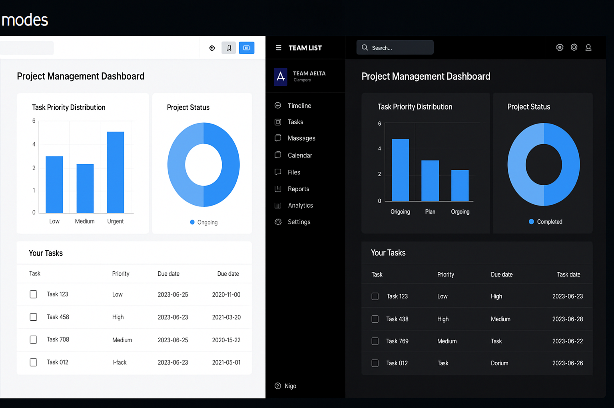

# CloudTrack – AWS Serverless Project Management Dashboard

CloudTrack is a cloud-native, full-stack project management dashboard architected using AWS serverless technologies. Designed for agile product teams, it provides a centralized platform to authenticate users, manage projects, assign tasks, monitor progress, and collaborate in real-time. With modular components and a scalable backend, CloudTrack supports team coordination through a Kanban-style interface and light/dark dashboard analytics.

---

## Tech Stack

### Frontend
- **React.js** with **Next.js** (App Router)
- **Tailwind CSS** for UI styling
- **AWS Amplify Console** for static hosting and CI/CD

### Backend
- **AWS Lambda** for business logic (API handlers)
- **Amazon API Gateway** for RESTful endpoint management
- **Amazon EC2** for optional persistent backend services
- **Amazon RDS (PostgreSQL)** for structured data storage
- **Amazon Cognito** for user authentication (User Pools, Identity Pools)
- **Amazon S3** for asset and document storage (optional)
- **Node.js / Express** microservices for backend modules

---

## Features

- **User Authentication**: Secure signup, login, and session management with Amazon Cognito.
- **Project Management**: Create and track projects, deadlines, and assigned users.
- **Task Lifecycle Control**: Move tasks between statuses (To Do → In Progress → Under Review → Completed).
- **Team Collaboration**: Assign team members, view responsibilities, and write comments.
- **Analytics Dashboard**: Monitor project health and task distributions in both light and dark themes.
- **Scalable Backend**: Built using AWS Lambda and EC2 to adapt based on workload.
- **Responsive UI**: Accessible across devices with dynamic theme switching.
- **Clean Codebase**: Modular structure with `client` (frontend) and `server` (backend) separation.

---

## AWS Architecture Overview

This system is designed using scalable and managed AWS services. The frontend is statically hosted using AWS Amplify. Users authenticate using Cognito, which manages sessions and identity federation. All authenticated API requests pass through Amazon API Gateway, which routes them to AWS Lambda functions (for stateless operations) or to EC2 services (for persistent server logic). Data is securely stored and queried via Amazon RDS.

---

## Data Model

The application follows a normalized relational data model using PostgreSQL. Each entity is logically separated to ensure modularity and referential integrity. Many-to-many and one-to-many relationships are modeled through association tables.

---

## Authentication Flow

Authentication is managed by Amazon Cognito. Users sign in through Cognito’s hosted UI or integrated components. After login, Cognito issues access and ID tokens, which are passed along with API requests. The backend verifies the tokens and maps the authenticated identity to internal user records stored in PostgreSQL. Cognito Identity Pools also enable secure, temporary access to other AWS services if needed (e.g., file upload to S3).

---

## Screenshots

### Kanban Board

The Kanban board visually separates tasks into workflow stages, making it easy to track progress. Users can drag and drop tasks between columns, update metadata such as assignee, tags, due dates, and view status at a glance.

---

### Light and Dark Mode Dashboards

The dashboard includes interactive visualizations to monitor task statuses, project completion rates, and team distribution. Both light and dark modes are supported to enhance accessibility and visual comfort across devices.

